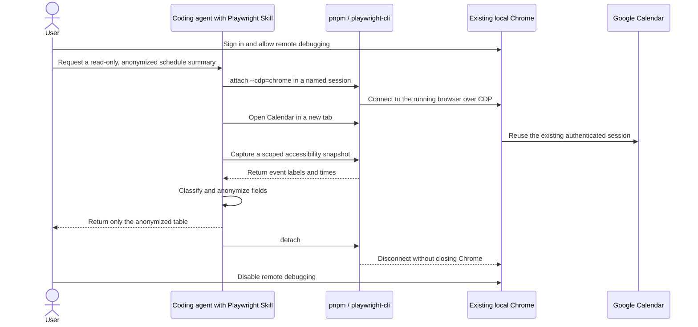

<!-- translation-meta
source: docs/scenarios/attach-authenticated-local-chrome/README.md
sourceHash: sha256:8ee1f6e68788827455ea92643cd5538c3760c02019433de3f59bd396dbad8c49
canonicalLanguage: en
-->

<a id="attach-to-an-authenticated-local-chrome-session"></a>

# 認証済みのローカル Chrome セッションにアタッチする

<a id="purpose"></a>

## 目的

このシナリオでは、プロジェクトローカルの Playwright CLI とその Agent Skill を使用して、
macOS 上ですでに実行中の Google Chrome インスタンスにアタッチします。次に、別のタブで
Google Calendar を開き、範囲を限定したアクセシビリティスナップショットから当日の予定を
読み取り、匿名化した概要を生成します。

この方法は、対象アプリケーションで SSO、2 要素認証、またはローカルブラウザーですでに
完了している別のログインフローが使用されている場合に便利です。`attach` は実行中の
ブラウザーに接続します。Chrome プロファイルをコピーしたり、認証情報を新しい Playwright
プロファイルへエクスポートしたりすることはありません。

このドキュメントのサンプル予定と出力は架空のものです。元の実行に含まれていたイベント名、
時刻、カレンダー名、アカウント識別子、出席者、場所、説明、および URL は保持していません。

<a id="what-this-scenario-demonstrates"></a>

## このシナリオで確認できること

- このリポジトリで pnpm によりロックされたバージョンの `@playwright/cli` を使用する方法。
- コーディングエージェントに Playwright 固有のコマンドとワークフローの知識を与える方法。
- ユーザーの同意に基づく Chrome のリモートデバッグを有効にし、チャネルでアタッチする方法。
- 名前付き Playwright CLI セッションでワークフローを分離する方法。
- Google Calendar を新しいタブで開き、既存のタブを維持する方法。
- 部分的なアクセシビリティスナップショットでデータの露出を減らす方法。
- カレンダーイベントを終日項目や保留中のタスクと区別する方法。
- ブラウザー出力をチャット、Issue、またはレポートに含める前に匿名化する方法。
- ユーザーの既存の Chrome ウィンドウを閉じずにデタッチする方法。

<a id="security-and-privacy-boundary"></a>

## セキュリティとプライバシーの境界

認証済みブラウザーへのアタッチは特権操作です。アタッチしたクライアントは、その Chrome
インスタンスから利用できるページを検査し、操作できます。このシナリオは、信頼できる
コンピューターと信頼できるコーディングエージェントを使用し、ブラウザーを確認できる状態で
のみ実行してください。

この読み取り専用シナリオでは、次の制約を守ってください。

- `state-save`、`cookie-list`、`cookie-get`、`localstorage-list`、または
  `sessionstorage-list` を実行しないでください。
- エージェントにイベントの作成、編集、承諾、辞退、または削除を依頼しないでください。
- 未加工のスナップショット、スクリーンショット、タブ一覧、リクエストログ、またはコンソール
  出力を公開ドキュメントへ貼り付けないでください。
- `.playwright-cli/` または `artifacts/` をコミットしないでください。どちらのパスもこの
  リポジトリでは無視されますが、コミット前に `git status` を確認してください。
- ログイン、2 要素認証、CAPTCHA、および Chrome のリモートデバッグへの同意は自分で完了して
  ください。パスワード、パスキー、リカバリコード、またはワンタイムコードをエージェント経由で
  送信しないでください。
- ワークフローが完了したら速やかにデタッチし、リモートデバッグを無効にしてください。

Chrome は、リモートデバッグが Cookie の抽出に悪用されてきたことを説明しています。
Chrome 136 以降では、デフォルトの Chrome データディレクトリに対して
`--remote-debugging-port` と `--remote-debugging-pipe` のフラグは適用されなくなりました。
適用するには、デフォルト以外の `--user-data-dir` も指定する必要があります。このシナリオでは、
コマンドラインフラグを使ってこの保護を回避しません。代わりに、Playwright が文書化している
対話型の `chrome://inspect/#remote-debugging` 同意フローに従います。

<a id="how-the-pieces-fit-together"></a>

## 各要素の連携



<a id="prerequisites"></a>

## 前提条件

- 最新の Google Chrome がインストールされた macOS。
- Node.js 20 以降と pnpm。
- このリポジトリのロックファイルから依存関係がインストールされていること。
- 選択した Chrome プロファイルで Google Calendar を開ける Google アカウント。
- GitHub Copilot など、ローカル Agent Skills をサポートする信頼できるコーディング
  エージェント、またはコマンドを手動で実行するためのターミナル。

すべてのコマンドをリポジトリルートから実行してください。

<a id="step-1-verify-the-project-local-cli"></a>

## ステップ 1: プロジェクトローカルの CLI を確認する

このクローンをまだ準備していない場合は、ロックされた依存関係をインストールします。

```sh
pnpm install --frozen-lockfile
```

次に、CLI のバージョンを確認します。

```sh
pnpm exec playwright-cli --version
```

`pnpm exec` は、このプロジェクトの `node_modules/.bin` から `playwright-cli` を解決します。
そのため、無関係なグローバルインストールではなく、`package.json` と `pnpm-lock.yaml` で
固定されたバージョンを使用します。

<a id="step-2-install-and-use-the-playwright-cli-agent-skill"></a>

## ステップ 2: Playwright CLI Agent Skill をインストールして使用する

`.agents/skills` 規約を使用するエージェント向けに Skill ファイルをインストールします。

```sh
pnpm run pw:install-skills
```

リポジトリのスクリプトは次のコマンドに展開されます。

```sh
pnpm exec playwright-cli install --skills=agents
```

インストールされた Skill は、ブラウザーセッション、スナップショット、ストレージ状態、
トレース、リクエストのモック、任意の Playwright コード、およびその他の CLI ワークフローに
関する構造化されたガイダンスを、互換性のあるコーディングエージェントに提供します。
Skill 自体がブラウザーへのアクセスを許可するわけではありません。Chrome には、後で行う
明示的なアタッチが引き続き必要です。

同じリクエスト内で、Skill を明示的に使用し、安全上の制約を示すようエージェントに依頼します。
例を次に示します。

> Playwright CLI Agent Skills を使用して、既存の Google Chrome セッション `calendar-local` に
> アタッチしてください。新しいタブで Google Calendar の本日の日ビューを開き、何も変更せずに
> スケジュールを確認してください。
>
> レスポンスにイベントのタイトル、日付、時刻、カレンダー名、アカウント、参加者、場所、説明、
> URL を含める前に、架空の値または `[REDACTED]` に置き換えてください。Cookie やストレージ状態を
> 表示または保存せず、既存のタブを閉じず、完了時には Chrome を閉じずにデタッチしてください。
> ログイン、2FA、CAPTCHA、または Chrome の接続許可が必要な場合は、ブラウザーで私が対応できる
> よう一時停止してください。

適切に動作するエージェントは、Skill を手順のガイダンスとして使用し、バージョン固有の詳細が
不明な場合はローカル CLI のヘルプを確認し、認証とブラウザーの同意について人間の関与を
維持する必要があります。

<a id="step-3-prepare-the-existing-chrome-session"></a>

## ステップ 3: 既存の Chrome セッションを準備する

1. 目的の Google アカウントが含まれる Chrome プロファイルを開きます。
2. [Google Calendar](https://calendar.google.com/) に移動します。
3. Chrome で直接ログインし、アカウントを選択します。
4. 自動化を許可する前に、カレンダーが表示されていることを確認します。
5. 可能であれば、関係のない機密性の高いタブを閉じるか非表示にします。`tab-list` により、
   アタッチしたクライアントへページタイトルと URL が公開される可能性があります。

通常のプロファイルディレクトリを使って 2 つ目の Chrome プロセスを起動しないでください。
このワークフローは、Chrome で選択した実行中のインスタンスへ意図的にアタッチします。

<a id="step-4-allow-remote-debugging-in-chrome"></a>

## ステップ 4: Chrome でリモートデバッグを許可する

macOS で Chrome の同意ページを開きます。

```sh
open -a "Google Chrome" "chrome://inspect/#remote-debugging"
```

`open -a "Google Chrome"` は、macOS に URL を Google Chrome で開くよう指示します。この URL
は Chrome 内部の設定ページであり、Web サイトには送信されません。

そのページで **Allow remote debugging for this browser
instance** を手動で有効にします。Chrome で追加の確認が表示される場合があります。
この同意は `attach --cdp=chrome` に必要であり、エージェントが回避を試みてはいけません。

次のステップが成功するまでページを開いたままにしてください。公開インターフェイスで
デバッグポートを公開したり、信頼できないマシンへ転送したりしないでください。

<a id="step-5-attach-with-a-named-session"></a>

## ステップ 5: 名前付きセッションでアタッチする

CLI を実行中の安定版 Chrome チャネルにアタッチします。

```sh
pnpm exec playwright-cli -s=calendar-local attach --cdp=chrome
```

各引数には、それぞれ次の役割があります。

| 部分 | 意味 |
| --- | --- |
| `pnpm exec` | このリポジトリにインストールされた依存関係を実行します。 |
| `playwright-cli` | Playwright CLI クライアントを起動します。 |
| `-s=calendar-local` | この接続を個別のセッション名で保存します。 |
| `attach` | すでに実行中のブラウザーへ接続します。 |
| `--cdp=chrome` | CDP 経由で安定版 Chrome チャネルへ接続します。 |

匿名化された成功結果は次の形式です。

```text
Session `calendar-local` created, attached to `chrome`.
```

以降のすべてのコマンドにセッション名を指定する必要があります。これにより、ワークフローが
誤って別の Playwright CLI セッションを対象にすることを防ぎます。

<a id="step-6-inspect-tabs-and-open-a-dedicated-calendar-tab"></a>

## ステップ 6: タブを確認して専用の Calendar タブを開く

アタッチしたブラウザーのタブを一覧表示します。

```sh
pnpm exec playwright-cli -s=calendar-local tab-list
```

結果は、現在のタブを確認するためだけに使用してください。タブのタイトルと URL は非公開の
出力として扱ってください。

既存の個人用タブを移動するのではなく、新しいタブを開きます。

```sh
pnpm exec playwright-cli -s=calendar-local tab-new \
  'https://calendar.google.com/calendar/r/day'
```

`tab-new` は既存のタブを維持し、新しいタブを現在のタブにします。`/r/day` ルートは
Calendar の日表示を要求します。Google は、有効なアカウント、ロケール、および現在の日付に
応じてリダイレクトする場合があります。

必要に応じて、現在のタブを確認します。

```sh
pnpm exec playwright-cli -s=calendar-local tab-list
```

Google がアカウント選択画面またはログインページを表示した場合は停止し、Chrome で手動で
解決してください。`fill`、`type`、またはエージェントチャット経由で認証情報を送信しないで
ください。

<a id="step-7-capture-only-the-calendar-content"></a>

## ステップ 7: Calendar のコンテンツだけを取得する

Playwright CLI のスナップショットは、ビットマップのスクリーンショットではなく、
アクセシビリティツリーです。これには、セマンティックロール、アクセシブル名、および `e42`
などの一時的な要素 ref が含まれます。Calendar はイベントの時刻とタイトルをこれらの
アクセシブル名で公開するため、通常は OCR やピクセルの検査を行わずにエージェントが予定を
要約できます。

ブラウザーページ全体ではなく、Calendar のメイン領域を取得します。

```sh
pnpm exec playwright-cli -s=calendar-local --raw snapshot \
  "getByRole('main')" --depth=10
```

| オプション | 目的 |
| --- | --- |
| `--raw` | CLI のステータスセクションを削除しますが、ページ内容を秘匿化するものでは**ありません**。 |
| `snapshot` | 現在のアクセシビリティツリーを読み取り、一時的な ref を割り当てます。 |
| `getByRole('main')` | 収集範囲を Calendar の main ランドマークに限定します。 |
| `--depth=10` | ネストされたイベントを維持しながらツリーの深さを制限します。 |

そのスナップショットでイベントコレクションが一時的な ref の下にある場合は、そのサブツリー
だけを確認します。`e42` を最新の出力に含まれる ref へ置き換えてください。

```sh
pnpm exec playwright-cli -s=calendar-local --raw snapshot e42 --depth=10
```

ref は、それを生成したページ状態でのみ有効です。ナビゲーション、ダイアログの変更、または
Calendar の再レンダリング後は、古い ref を再利用せず、新しいスナップショットを取得して
ください。

このシナリオでは、イベントをクリックするより、アクセシブルなイベントラベルを読むことを
推奨します。イベントを開くと、日次概要には不要な出席者、会議リンク、説明、および場所が
公開される可能性があります。

<a id="step-8-classify-the-result-before-summarizing-it"></a>

## ステップ 8: 要約前に結果を分類する

日表示には、時刻付きのカレンダーイベント以外も含まれる場合があります。各項目を
アクセシブルラベルに含まれる情報で分類します。

| 項目の種類 | 一般的な特徴 | 処理 |
| --- | --- | --- |
| 時刻付きイベント | 開始時刻、終了時刻、タイトル、および日付 | 匿名化後に含めます。 |
| 終日イベント | 開始時刻と終了時刻がない | `All day` を使用し、タイトルを匿名化します。 |
| 保留中のタスク | 保留中タスクのコントロール | 今日が期限と明示されていなければ分けます。 |
| 共有イベント | ラベルに所有者またはカレンダーが含まれる | 所有者とカレンダーを置き換えます。 |

"N events" のような見出しが、時刻付きミーティングが正確に N 件あることを意味するとは
想定しないでください。Calendar は、同じ表示領域にある終日項目やタスク関連のコントロールも
数える場合があります。集計数より、個々のイベントラベルを優先してください。

<a id="step-9-anonymize-before-producing-output"></a>

## ステップ 9: 出力前に匿名化する

ブラウザー由来のテキストが非公開の作業コンテキストを離れる前に匿名化します。人物、
アカウント、習慣、組織、または実世界の活動を特定できるすべてのフィールドを置換または変更
してください。

| ソースフィールド | 安全な表現 |
| --- | --- |
| イベントタイトル | `[Event A]`、`[Event B]` など |
| 正確な日付 | ユーザーが保持を明示的に承認しない限り、`[DATE]` |
| 正確な時刻 | 架空の時刻または `[START]`–`[END]` |
| アカウントまたはメール | `[ACCOUNT]` |
| カレンダーまたは所有者 | `[Calendar A]` |
| 出席者 | `[ATTENDEES REDACTED]` |
| 場所 | `[LOCATION REDACTED]` |
| 説明 | 言い換えずに省略します。 |
| ミーティングまたはイベントの URL | 完全に省略します。 |
| 繰り返しと重複 | 習慣を推測できる場合は省略または変更します。 |

次の形式は、許容される架空の結果です。これらの値を実際のカレンダーからコピーしないで
ください。

| 時刻 | イベント | カレンダー | 場所 |
| --- | --- | --- | --- |
| 09:00-10:00 | `[Event A]` | `[Calendar A]` | `[LOCATION REDACTED]` |
| 13:00-14:30 | `[Event B]` | `[Calendar A]` | `[LOCATION REDACTED]` |
| 16:00-17:00 | `[Event C]` | `[Calendar B]` | `[LOCATION REDACTED]` |

運用レポートで実際の時刻が必要でも、識別情報が不要な場合は、その例外をリクエストに明記し、
その他すべてのフィールドを引き続き匿名化してください。時刻やイベント数が機密情報ではないと
暗黙に想定しないでください。

<a id="step-10-detach-without-closing-chrome"></a>

## ステップ 10: Chrome を閉じずにデタッチする

名前付き CLI セッションを切断します。

```sh
pnpm exec playwright-cli -s=calendar-local detach
```

`detach` は Playwright 接続を終了しますが、外部の Chrome プロセスとそのタブは実行中のままに
します。これは、CLI セッションで管理されるブラウザーを閉じるための `close` とは異なります。

成功結果は次の形式です。

```text
Browser 'calendar-local' detached
```

`chrome://inspect/#remote-debugging` に戻り、**Allow remote
debugging for this browser instance** を無効にします。専用の Calendar タブが不要になった場合は
閉じてください。

最後に、ブラウザー由来のアーティファクトがコミットされようとしていないことを確認します。

```sh
git status --short
```

<a id="agent-automation-pattern"></a>

## エージェントによる自動化パターン

Agent Skill は、単一の不透明なスクリプトではなく、観察、判断、実行のループをサポートします。

1. **検出**: インストール済みの Playwright CLI Skill を読み、バージョン固有の構文について
   ローカルの `--help` 出力を確認します。
2. **同意**: Chrome でログインとリモートデバッグの許可を完了するようユーザーに依頼します。
3. **アタッチ**: 名前付きセッションと `--cdp=chrome` を使用します。
4. **分離**: 要求されたアプリケーション用に新しいタブを作成します。
5. **観察**: 関連するランドマークに範囲を限定した、深さ制限付きスナップショットを取得します。
6. **絞り込み**: ページが大きい場合は、最新のスナップショットに含まれる ref を使用して
   イベントのサブツリーだけを確認します。
7. **解釈**: 時刻付きイベント、終日イベント、および保留中のタスクを区別します。
8. **サニタイズ**: ユーザーに表示する出力を作成する前に、機密値を置き換えます。
9. **確認**: 表示されている日付と抽出した項目ラベルの数を確認しますが、未加工のラベルは
   開示しません。
10. **デタッチ**: 切断し、Chrome のデバッグ権限を取り消すようユーザーに通知します。

このパターンにより、認証、認可、および開示に関する明確な人間のチェックポイントを維持しつつ、
エージェントが Calendar の UI 変更に適応できます。

<a id="troubleshooting"></a>

## トラブルシューティング

<a id="could-not-connect-to-chrome-or-econnrefused-19222"></a>

### `Could not connect to chrome` または `ECONNREFUSED ::1:9222`

Chrome は実行中ですが、そのインスタンスでリモートデバッグが有効になっていません。同意ページを
開き、設定を有効にして、もう一度アタッチします。

```sh
open -a "Google Chrome" "chrome://inspect/#remote-debugging"
pnpm exec playwright-cli -s=calendar-local attach --cdp=chrome
```

対応として、ポート 9222 をネットワークに公開しないでください。

### `Playwright Extension not found`

このエラーは、ここで使用する CDP チャネルのワークフローではなく、
`attach --extension=chrome` に該当します。Chrome のデバッグ権限を付与した後に
`--cdp=chrome` を使用し続けるか、公式の Playwright Extension をインストールして意図的に
拡張機能モードを使用してください。権限を確認せず、エラーを消すためだけに拡張機能を
インストールしないでください。

<a id="a-command-succeeds-but-its-automatic-snapshot-fails-with-strict-mode"></a>

### コマンドは成功するが、自動スナップショットが strict mode で失敗する

インストール済みのブラウザー拡張機能が別の document または `body` を挿入し、ページ全体の
自動スナップショットが曖昧になる場合があります。まず `tab-list` を使用してナビゲーションが
行われたことを確認します。次に、範囲を限定したスナップショットを明示的に要求します。

```sh
pnpm exec playwright-cli -s=calendar-local tab-list
pnpm exec playwright-cli -s=calendar-local --raw snapshot \
  "getByRole('main')" --depth=10
```

自動スナップショットのエラーを、先行するナビゲーションが失敗した証拠として扱わないで
ください。

### `Ref e42 not found in the current page snapshot`

その ref が割り当てられた後にページが変更されています。範囲を限定した新しいスナップショットを
取得し、新しい ref を使用してください。再利用可能な自動化に ref をハードコードしないで
ください。

<a id="calendar-opens-with-the-wrong-account"></a>

### Calendar が別のアカウントで開く

Chrome で目的のアカウントを手動で選択してから、日表示のタブをもう一度開いてください。
CLI は、Chrome が現在公開している認証済みブラウザー状態を再利用します。CLI が独自に
アカウントを選択することはありません。

<a id="the-snapshot-contains-more-private-data-than-expected"></a>

### スナップショットに想定より多くの個人情報が含まれる

共有する前に停止してください。スナップショットの範囲を `main` または現在のサブツリー ref に
絞り、スクリーンショットとリクエストログを省略し、非公開の結果を匿名化してください。
`--raw` フラグは形式を変更するだけで、プライバシーフィルターではありません。

<a id="success-criteria"></a>

## 成功条件

- プロジェクトローカルの Playwright CLI が、すでに実行中の Chrome にアタッチすること。
- パスワードの入力やストレージ状態のエクスポートを行わずに、認証済みの既存 Calendar
  セッションが再利用されること。
- 既存のタブが開いたままで、Calendar が専用タブに開かれること。
- エージェントが関連する Calendar 領域だけを読み取り、変更操作を行わないこと。
- 共有される結果に、実際のイベント、アカウント、人物、場所、説明、URL、正確な時刻、または
  習慣に関する情報が含まれないこと。
- `detach` 後も Chrome が実行中で、リモートデバッグが無効になっていること。
- `git status --short` に、コミット対象のスナップショット、スクリーンショット、トレース、
  または認証状態のアーティファクトが含まれないこと。

<a id="references"></a>

## 参考資料

2026-08-08 に参照した一次資料:

- [Playwright CLI: Attach](https://playwright.dev/agent-cli/commands/attach) -
  チャネルへのアタッチ、CDP エンドポイント、拡張機能モード、名前付きセッション、および
  Chrome のリモートデバッグ同意ワークフロー。
- [Playwright CLI: Skills](https://playwright.dev/agent-cli/skills) - Agent Skills の
  インストール、サポートされるエージェント、および Skill に含まれるワークフローの知識。
- [Playwright CLI: Snapshots](https://playwright.dev/agent-cli/snapshots) -
  アクセシビリティスナップショット、一時的な ref、部分スナップショット、深さ制限、未加工の
  出力、および locator の代替手段。
- [Playwright CLI: Sessions and Dashboard](https://playwright.dev/agent-cli/sessions) -
  名前付きセッション、プロファイルの動作、セッション管理、およびストレージ状態の機能。
- [Playwright CLI: Installation](https://playwright.dev/agent-cli/installation) -
  前提条件、ローカル CLI の使用、ブラウザーのインストール、および Skill のインストール。
- [Chrome remote-debugging security changes][chrome-remote-debugging] -
  Cookie 抽出のリスク、Chrome 136 の動作、デフォルト以外のユーザーデータディレクトリ、および
  Chrome for Testing のガイダンス。

[chrome-remote-debugging]: https://developer.chrome.com/blog/remote-debugging-port
