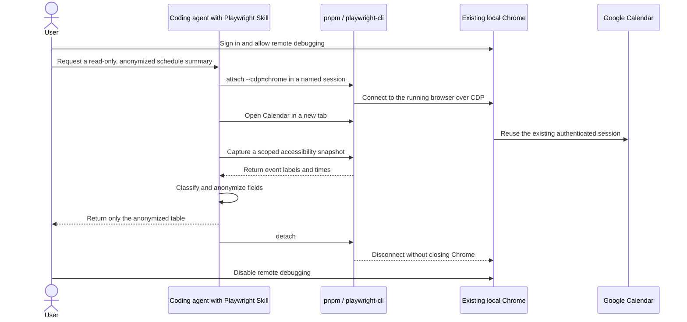

# Attach to an Authenticated Local Chrome Session

## Purpose

This scenario uses the project-local Playwright CLI and its Agent Skill to
attach to an already-running Google Chrome instance on macOS. It then opens
Google Calendar in a separate tab, reads the current day's schedule through a
scoped accessibility snapshot, and produces an anonymized summary.

This is useful when the target application uses SSO, two-factor authentication,
or another login flow that has already been completed in the local browser.
`attach` connects to the live browser; it does not copy the Chrome profile or
export credentials into a new Playwright profile.

The sample schedule and output in this document are synthetic. Event names,
times, calendar names, account identifiers, attendees, locations, descriptions,
and URLs from the original run have not been retained.

## What this scenario demonstrates

- Using the `@playwright/cli` version locked by pnpm in this repository.
- Giving a coding agent Playwright-specific command and workflow knowledge.
- Enabling Chrome's user-consented remote debugging and attaching by channel.
- Isolating the workflow with a named Playwright CLI session.
- Preserving existing tabs by opening Google Calendar in a new tab.
- Reducing data exposure with a partial accessibility snapshot.
- Separating calendar events from all-day items and pending tasks.
- Anonymizing browser output before including it in chat, an issue, or a report.
- Detaching without closing the user's existing Chrome window.

## Security and privacy boundary

Attaching to an authenticated browser is a privileged operation. The attached
client can inspect and operate pages available to that Chrome instance. Run this
scenario only on a trusted computer, with a trusted coding agent, and while you
can observe the browser.

For this read-only scenario:

- Do not run `state-save`, `cookie-list`, `cookie-get`, `localstorage-list`, or
  `sessionstorage-list`.
- Do not ask the agent to create, edit, accept, decline, or delete events.
- Do not paste raw snapshots, screenshots, tab lists, request logs, or console
  output into a public document.
- Do not commit `.playwright-cli/` or `artifacts/`. Both paths are ignored by
  this repository, but review `git status` before committing.
- Complete login, two-factor authentication, CAPTCHA, and Chrome's remote
  debugging consent yourself. Never send a password, passkey, recovery code, or
  one-time code through the agent.
- Detach promptly and disable remote debugging when the workflow is complete.

Chrome documents that remote debugging has been abused to extract cookies. In
Chrome 136 and newer, the `--remote-debugging-port` and
`--remote-debugging-pipe` flags no longer apply to the default Chrome data
directory unless a non-default `--user-data-dir` is also supplied. This scenario
does not work around that protection with command-line flags. It follows the
interactive `chrome://inspect/#remote-debugging` consent flow documented by
Playwright instead.

## How the pieces fit together



## Prerequisites

- macOS with a current Google Chrome installation.
- Node.js 20 or newer and pnpm.
- Dependencies installed from this repository's lockfile.
- A Google account that can open Google Calendar in the selected Chrome
  profile.
- A trusted coding agent that supports local Agent Skills, such as GitHub
  Copilot, or a terminal for running the commands manually.

Run every command from the repository root.

## Step 1: Verify the project-local CLI

Install the locked dependencies if this clone has not been prepared yet:

```sh
pnpm install --frozen-lockfile
```

Then verify the CLI version:

```sh
pnpm exec playwright-cli --version
```

`pnpm exec` resolves `playwright-cli` from this project's `node_modules/.bin`.
It therefore uses the version pinned in `package.json` and `pnpm-lock.yaml`
instead of an unrelated global installation.

## Step 2: Install and use the Playwright CLI Agent Skill

Install the skill files for agents that use the `.agents/skills` convention:

```sh
pnpm run pw:install-skills
```

The repository script expands to:

```sh
pnpm exec playwright-cli install --skills=agents
```

The installed Skill gives a compatible coding agent structured guidance for
browser sessions, snapshots, storage state, tracing, request mocking, arbitrary
Playwright code, and other CLI workflows. It does not grant browser access by
itself. Chrome still requires the explicit attachment performed later.

Ask the agent to use the Skill explicitly and state the safety constraints in
the same request. For example:

```text
Use the Playwright CLI Agent Skills to attach to the existing Google Chrome
session with the name `calendar-local`. Open today's day view in Google
Calendar in a new tab and inspect the schedule without making any changes.

Before including event titles, dates, times, calendar names, accounts,
attendees, locations, descriptions, or URLs in your response, replace them with
fictional values or `[REDACTED]`. Do not display or save cookies or storage
state, do not close any existing tabs, and detach without closing Chrome when
finished. If login, 2FA, CAPTCHA, or Chrome connection permission is required,
pause so that I can handle it in the browser.
```

A well-behaved agent should use the Skill as procedural guidance, inspect the
local CLI help when a version-specific detail is uncertain, and keep the human
in the loop for authentication and browser consent.

## Step 3: Prepare the existing Chrome session

1. Open the Chrome profile that contains the intended Google account.
2. Navigate to [Google Calendar](https://calendar.google.com/).
3. Complete login and account selection directly in Chrome.
4. Confirm that the calendar is visible before allowing automation.
5. Close or hide unrelated sensitive tabs when practical. `tab-list` can expose
   page titles and URLs to the attached client.

Do not launch a second Chrome process with the normal profile directory. This
workflow deliberately attaches to the already-running instance selected by
Chrome.

## Step 4: Allow remote debugging in Chrome

Open Chrome's consent page on macOS:

```sh
open -a "Google Chrome" "chrome://inspect/#remote-debugging"
```

`open -a "Google Chrome"` asks macOS to open the URL in Google Chrome. The URL
is a Chrome-internal settings page and is not sent to a website.

On that page, manually enable **Allow remote debugging for this browser
instance**. Chrome may show an additional confirmation. This consent is required
for `attach --cdp=chrome`; the agent should not attempt to bypass it.

Keep the page open until the next step succeeds. Do not expose a debugging port
on a public interface or forward it to an untrusted machine.

## Step 5: Attach with a named session

Attach the CLI to the running stable Chrome channel:

```sh
pnpm exec playwright-cli -s=calendar-local attach --cdp=chrome
```

Each argument has a specific role:

| Part | Meaning |
| --- | --- |
| `pnpm exec` | Runs the dependency installed in this repository. |
| `playwright-cli` | Starts the Playwright CLI client. |
| `-s=calendar-local` | Stores this connection under a distinct session name. |
| `attach` | Connects to a browser that is already running. |
| `--cdp=chrome` | Connects to the stable Chrome channel over CDP. |

A successful, anonymized result has this shape:

```text
Session `calendar-local` created, attached to `chrome`.
```

The session name must be supplied to every later command. This prevents the
workflow from accidentally targeting another Playwright CLI session.

## Step 6: Inspect tabs and open a dedicated Calendar tab

List the attached browser's tabs:

```sh
pnpm exec playwright-cli -s=calendar-local tab-list
```

Use the result only to verify which tab is current. Treat tab titles and URLs as
private output.

Open a new tab instead of navigating an existing personal tab:

```sh
pnpm exec playwright-cli -s=calendar-local tab-new \
  'https://calendar.google.com/calendar/r/day'
```

`tab-new` preserves existing tabs and makes the new tab current. The `/r/day`
route requests Calendar's day view; Google may redirect it according to the
active account, locale, and current date.

Confirm the current tab when necessary:

```sh
pnpm exec playwright-cli -s=calendar-local tab-list
```

If Google shows an account chooser or sign-in page, stop and resolve it manually
in Chrome. Do not send credentials through `fill`, `type`, or agent chat.

## Step 7: Capture only the Calendar content

Playwright CLI snapshots are accessibility trees, not bitmap screenshots. They
contain semantic roles, accessible names, and temporary element refs such as
`e42`. Calendar exposes event time and title through these accessible names, so
the agent can usually summarize the schedule without OCR or pixel inspection.

Capture the main Calendar region instead of the entire browser page:

```sh
pnpm exec playwright-cli -s=calendar-local --raw snapshot \
  "getByRole('main')" --depth=10
```

| Option | Purpose |
| --- | --- |
| `--raw` | Removes CLI status sections; it does **not** redact page content. |
| `snapshot` | Reads the current accessibility tree and assigns temporary refs. |
| `getByRole('main')` | Scopes collection to Calendar's main landmark. |
| `--depth=10` | Limits tree depth while retaining nested events. |

If the event collection appears under a temporary ref in that snapshot, inspect
only that subtree. Replace `e42` with the ref from the latest output:

```sh
pnpm exec playwright-cli -s=calendar-local --raw snapshot e42 --depth=10
```

Refs are valid only for the page state that produced them. After navigation,
dialog changes, or a Calendar re-render, take a new snapshot instead of reusing
an old ref.

For this scenario, reading accessible event labels is preferred to clicking
events. Opening an event can reveal attendees, conferencing links, descriptions,
and locations that are unnecessary for a daily summary.

## Step 8: Classify the result before summarizing it

The day view can contain more than timed calendar events. Classify each item by
the information present in its accessible label:

| Item type | Typical signal | Handling |
| --- | --- | --- |
| Timed event | Start/end time, title, and date | Include after anonymization. |
| All-day event | No start and end time | Use `All day`; anonymize the title. |
| Pending task | Pending-task control | Separate unless explicitly due today. |
| Shared event | Owner or calendar in the label | Replace the owner and calendar. |

Do not assume that a heading such as "N events" means there are exactly N timed
meetings. Calendar may count all-day entries or task-related controls in the
same visible area. Prefer the individual event labels over the aggregate count.

## Step 9: Anonymize before producing output

Anonymization happens before browser-derived text leaves the private working
context. Replace or alter every field that could identify a person, account,
routine, organization, or real-world activity.

| Source field | Safe representation |
| --- | --- |
| Event title | `[Event A]`, `[Event B]`, and so on |
| Exact date | `[DATE]`, unless the user explicitly approves retaining it |
| Exact time | Synthetic times or `[START]`–`[END]` |
| Account or email | `[ACCOUNT]` |
| Calendar or owner | `[Calendar A]` |
| Attendees | `[ATTENDEES REDACTED]` |
| Location | `[LOCATION REDACTED]` |
| Description | Omit it rather than paraphrasing it |
| Meeting or event URL | Omit it completely |
| Recurrence and overlap | Omit or alter it if it could reveal a routine |

This is an acceptable synthetic result format. None of these values should be
copied from the live calendar:

| Time | Event | Calendar | Location |
| --- | --- | --- | --- |
| 09:00-10:00 | `[Event A]` | `[Calendar A]` | `[LOCATION REDACTED]` |
| 13:00-14:30 | `[Event B]` | `[Calendar A]` | `[LOCATION REDACTED]` |
| 16:00-17:00 | `[Event C]` | `[Calendar B]` | `[LOCATION REDACTED]` |

When an operational report needs real times but not identities, state that
exception in the request and still anonymize every other field. Do not silently
assume that times or event counts are non-sensitive.

## Step 10: Detach without closing Chrome

Disconnect the named CLI session:

```sh
pnpm exec playwright-cli -s=calendar-local detach
```

`detach` ends the Playwright connection but leaves the external Chrome process
and its tabs running. This differs from `close`, which is intended to close a
browser managed by a CLI session.

A successful result has this shape:

```text
Browser 'calendar-local' detached
```

Return to `chrome://inspect/#remote-debugging` and disable **Allow remote
debugging for this browser instance**. Close the dedicated Calendar tab if it is
no longer needed.

Finally, check that no browser-derived artifact is about to be committed:

```sh
git status --short
```

## Agent automation pattern

The Agent Skill supports an observe-decide-act loop rather than a single opaque
script:

1. **Discover**: Read the installed Playwright CLI Skill and check local
   `--help` output for version-specific syntax.
2. **Consent**: Ask the user to complete login and remote-debugging permission
   in Chrome.
3. **Attach**: Use a named session and `--cdp=chrome`.
4. **Isolate**: Create a new tab for the requested application.
5. **Observe**: Take a depth-limited snapshot scoped to the relevant landmark.
6. **Narrow**: Use refs from the latest snapshot to inspect only the event
   subtree when the page is large.
7. **Interpret**: Distinguish timed events, all-day events, and pending tasks.
8. **Sanitize**: Replace sensitive values before composing user-visible output.
9. **Verify**: Check the visible date and number of extracted item labels, but
   do not disclose the raw labels.
10. **Detach**: Disconnect and remind the user to revoke Chrome's debugging
    permission.

This pattern lets the agent adapt to Calendar UI changes while preserving clear
human checkpoints around authentication, authorization, and disclosure.

## Troubleshooting

### `Could not connect to chrome` or `ECONNREFUSED ::1:9222`

Chrome is running, but remote debugging is not enabled for that instance. Open
the consent page, enable the setting, and attach again:

```sh
open -a "Google Chrome" "chrome://inspect/#remote-debugging"
pnpm exec playwright-cli -s=calendar-local attach --cdp=chrome
```

Do not respond by exposing port 9222 to the network.

### `Playwright Extension not found`

This error applies to `attach --extension=chrome`, not the CDP channel workflow
used here. Either continue with `--cdp=chrome` after granting Chrome's debugging
permission, or install the official Playwright Extension and deliberately use
extension mode. Do not install an extension merely to suppress the error without
reviewing its permissions.

### A command succeeds but its automatic snapshot fails with strict mode

An installed browser extension can inject another document or `body`, making a
full-page automatic snapshot ambiguous. First use `tab-list` to verify that the
navigation occurred. Then request a scoped snapshot explicitly:

```sh
pnpm exec playwright-cli -s=calendar-local tab-list
pnpm exec playwright-cli -s=calendar-local --raw snapshot \
  "getByRole('main')" --depth=10
```

Do not treat an automatic snapshot error as proof that the preceding navigation
failed.

### `Ref e42 not found in the current page snapshot`

The page changed after that ref was assigned. Capture a fresh scoped snapshot
and use the new ref. Never hard-code a ref in reusable automation.

### Calendar opens with the wrong account

Select the intended account manually in Chrome, then reopen the day-view tab.
The CLI reuses whichever authenticated browser state Chrome currently exposes;
it does not choose an account independently.

### The snapshot contains more private data than expected

Stop before sharing it. Narrow the snapshot to `main` or a current subtree ref,
omit screenshots and request logs, and anonymize from the private result. The
`--raw` flag changes formatting only; it is not a privacy filter.

## Success criteria

- The project-local Playwright CLI attaches to the already-running Chrome.
- The existing authenticated Calendar session is reused without entering a
  password or exporting storage state.
- Existing tabs remain open and Calendar is opened in a dedicated tab.
- The agent reads only the relevant Calendar region and performs no mutations.
- The shared result contains no real event, account, person, location,
  description, URL, exact time, or routine information.
- `detach` leaves Chrome running, and remote debugging is disabled afterward.
- `git status --short` contains no snapshot, screenshot, trace, or auth-state
  artifact intended for commit.

## References

Primary sources consulted on 2026-08-08:

- [Playwright CLI: Attach](https://playwright.dev/agent-cli/commands/attach) -
  channel attachment, CDP endpoints, extension mode, named sessions, and the
  Chrome remote-debugging consent workflow.
- [Playwright CLI: Skills](https://playwright.dev/agent-cli/skills) - installing
  Agent Skills, supported agents, and the workflow knowledge included in a
  Skill.
- [Playwright CLI: Snapshots](https://playwright.dev/agent-cli/snapshots) -
  accessibility snapshots, temporary refs, partial snapshots, depth limits,
  raw output, and locator alternatives.
- [Playwright CLI: Sessions and Dashboard](https://playwright.dev/agent-cli/sessions) -
  named sessions, profile behavior, session management, and storage-state
  capabilities.
- [Playwright CLI: Installation](https://playwright.dev/agent-cli/installation) -
  prerequisites, local CLI use, browser installation, and Skill installation.
- [Chrome remote-debugging security changes][chrome-remote-debugging] -
  cookie-extraction risks, Chrome 136 behavior, non-default user-data
  directories, and Chrome for Testing guidance.

[chrome-remote-debugging]: https://developer.chrome.com/blog/remote-debugging-port
