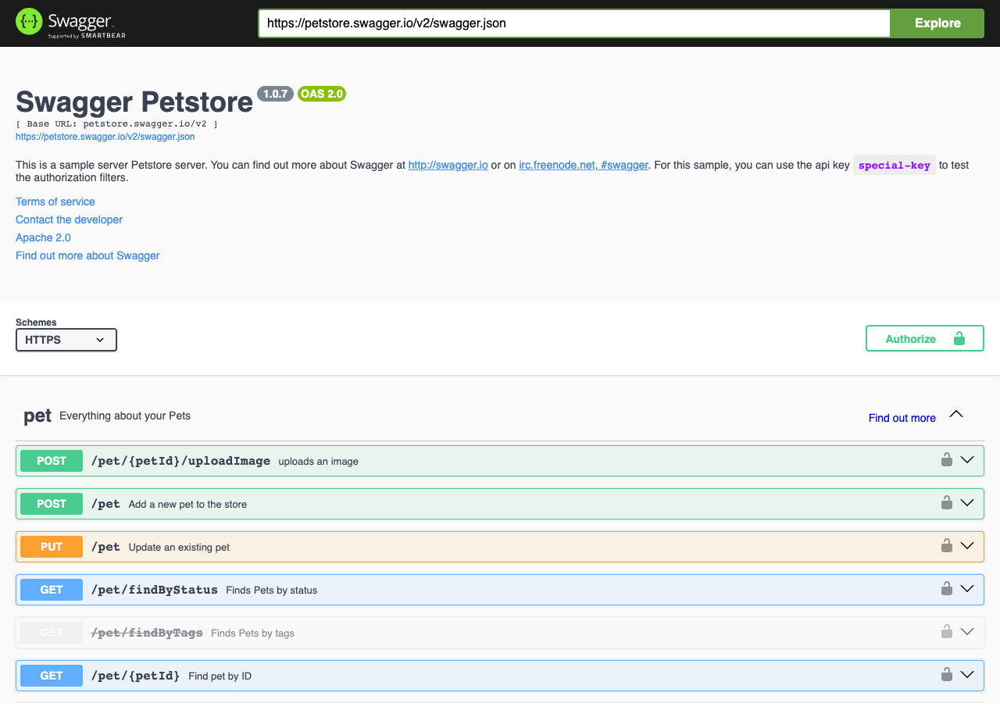
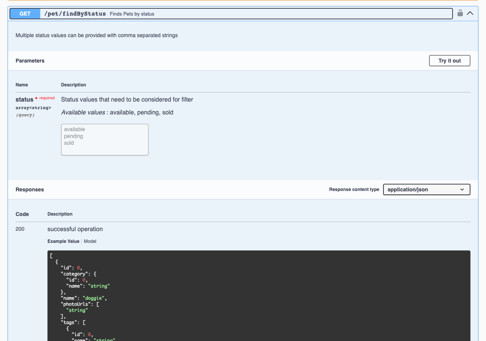
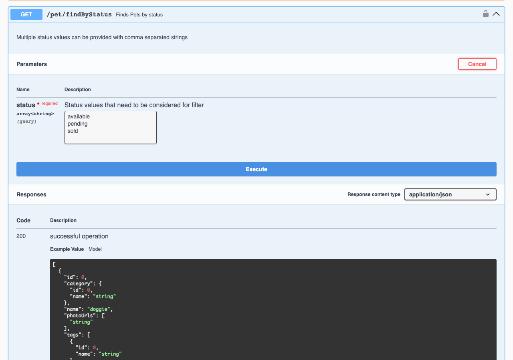
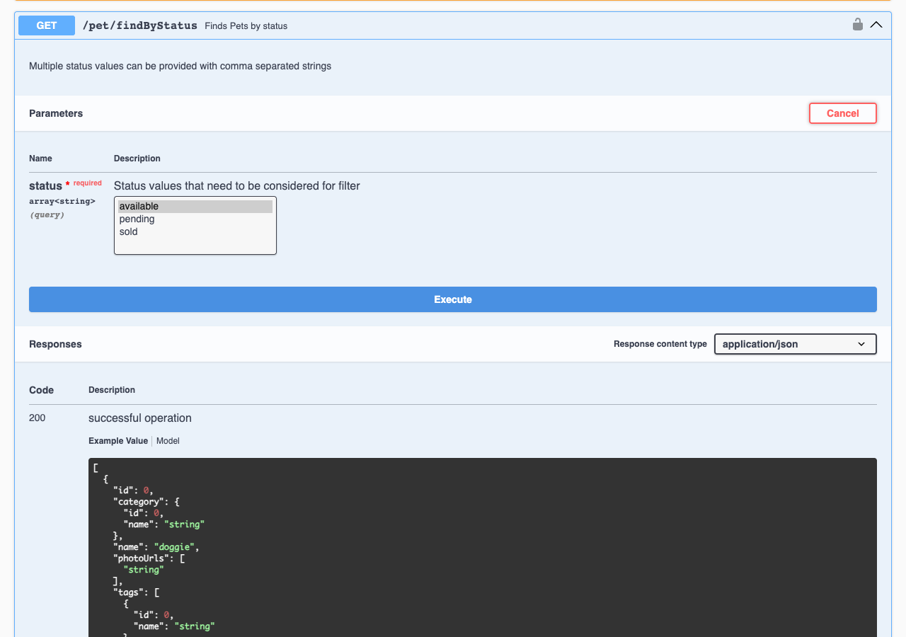
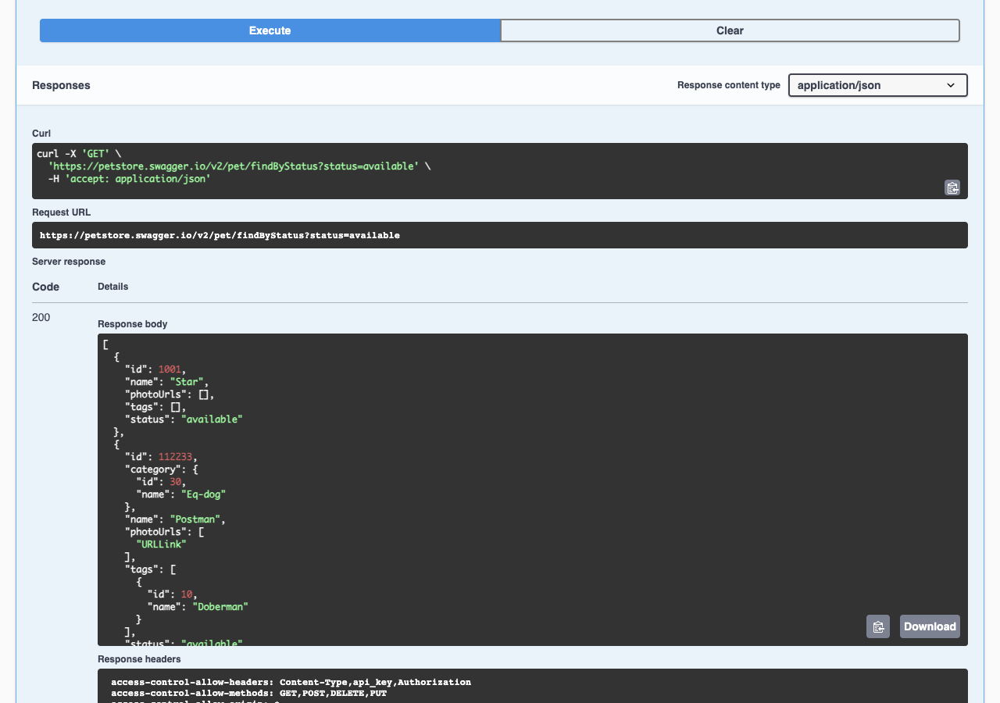
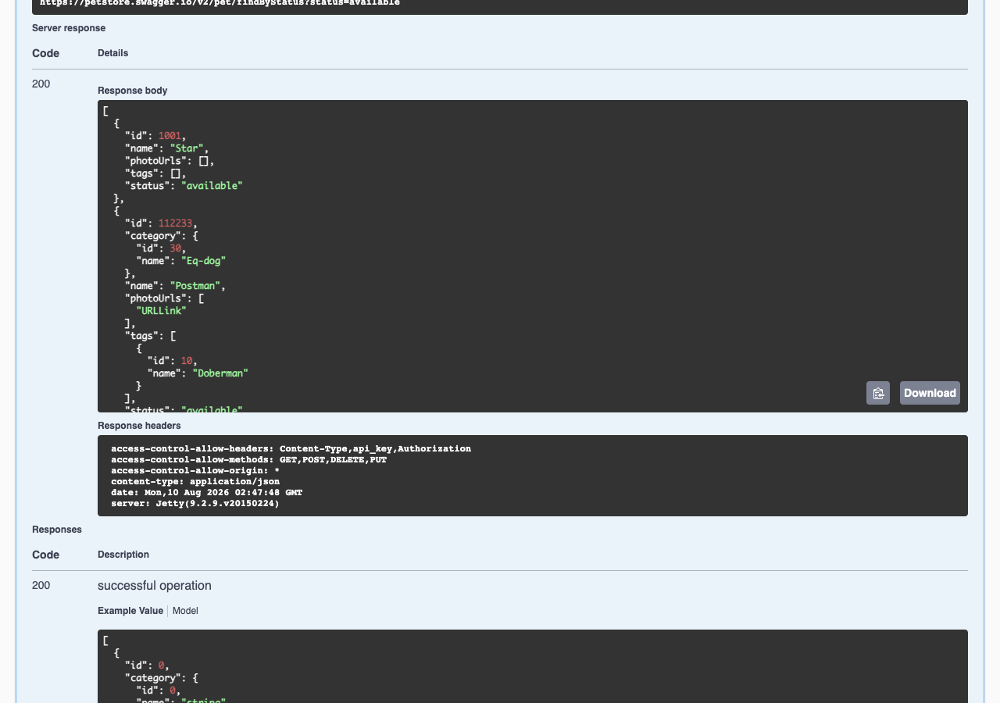

# Try an API in Swagger UI (Petstore): A Beginner's Walkthrough

This guide shows you, step by step and with screenshots, how to call a real API
from your web browser using **Swagger UI**. No programming, terminal, or account
is required — just a browser.

We use the public **Swagger Petstore** demo at
[https://petstore.swagger.io/](https://petstore.swagger.io/). You will send one
real request to the `GET /pet/findByStatus` operation and read the response.

> **About the screenshots:** They were captured with Playwright CLI against the
> live site. The Petstore is a shared public sandbox, so the exact pets in your
> response will differ from the examples shown here.

## What is Swagger UI?

Swagger UI is an interactive documentation page for a web API. Each row on the
page is one API **operation** (an action the API can perform). You can expand an
operation to read what it does, then use the **Try it out** button to send a real
request and see the server's response — all from the browser.

## What you will do

1. Open the Petstore page and get familiar with the layout.
2. Find and expand the `GET /pet/findByStatus` operation.
3. Turn on **Try it out** mode.
4. Choose a `status` value (`available`).
5. Click **Execute** to send the request.
6. Read the server's response.

## Before you start

- A web browser (Chrome, Edge, Firefox, or Safari).
- An internet connection.

## Step 1: Open the page and look around

Open [https://petstore.swagger.io/](https://petstore.swagger.io/) in your
browser. If a cookie notice appears, choose an option (for example, **Allow all
cookies**) to close it.

Key areas to notice:

- **Title** — "Swagger Petstore", the version `1.0.7`, and the API standard
  `OAS 2.0`.
- **Base URL** — `petstore.swagger.io/v2`, the address that all requests are sent
  to.
- **Authorize** — used to sign in for operations that require it. You do **not**
  need it for this walkthrough.
- **Tag groups** — operations are grouped under **pet**, **store**, and **user**.
- Each colored badge (**GET**, **POST**, **PUT**, **DELETE**) is the HTTP
  method — the kind of action the operation performs.

## Step 2: Expand "GET /pet/findByStatus"

In the **pet** group, click the row labeled **GET** `/pet/findByStatus`
("Finds Pets by status") to expand it.

Now you can read the details:

- A short description: "Multiple status values can be provided with comma
  separated strings".
- A **Parameters** section listing the `status` parameter (marked *required*).
  Its allowed values are `available`, `pending`, and `sold`.
- A **Responses** section showing an example of what a successful (`200`)
  response looks like.

At this point the fields are read-only — you are just reading the documentation.

## Step 3: Turn on "Try it out"

Click the **Try it out** button on the right of the **Parameters** section.

The `status` field becomes editable, a blue **Execute** button appears, and the
**Try it out** button changes to **Cancel** (click **Cancel** any time to return
to read-only mode).

## Step 4: Choose a status value

In the `status` list, select **available**.

The selected value is highlighted. This tells the API that you only want pets
whose status is `available`.

## Step 5: Send the request with "Execute"

Click the blue **Execute** button.

Swagger UI sends the request to the API and shows you exactly what it sent:

- **Curl** — the same request written as a command-line `curl` command:
  `curl -X 'GET' 'https://petstore.swagger.io/v2/pet/findByStatus?status=available' -H 'accept: application/json'`
- **Request URL** — the exact address that was called:
  `https://petstore.swagger.io/v2/pet/findByStatus?status=available`

Notice how your choice of `available` became `?status=available` at the end of
the URL.

## Step 6: Read the server response

Scroll to the **Server response** section.

- **Code** — `200` means the request succeeded.
- **Response body** — the data the API returned: a list of pets in JSON format.
  Each pet has fields such as `id`, `name`, and `status`. (Your list will differ,
  because the Petstore is a shared public sandbox.)
- **Response headers** — extra information about the response, such as
  `content-type: application/json`.

You have now called a real API and read its response, entirely from your browser.

## What next?

- Repeat Step 4 with `pending` or `sold`, then Execute again to see how the
  result changes.
- Expand another operation, such as **GET** `/pet/{petId}` ("Find pet by ID"),
  and try it with a pet `id` taken from your response.
- Click **Clear** to remove a response, or **Cancel** to leave Try it out mode.

---

*This walkthrough was generated with the Playwright CLI Agent Skill against the
live site on 2026-08-10 (Playwright CLI `0.1.17`). Because the Petstore is a
shared public demo, the response data shown in the screenshots is a snapshot in
time and will differ when you try it yourself.*
