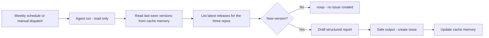

<!-- translation-meta
source: docs/scenarios/playwright-release-watch/README.md
sourceHash: sha256:4af217c07a1d04c2f269a76e1da5e3a1a07aaf2ce681c8b70396fb74af7cab79
canonicalLanguage: en
-->

# エージェントワークフローで Playwright のリリースを監視する

## 目的

このシナリオでは、このリポジトリが土台とする 3 つの Playwright ツール（Playwright、Playwright
CLI、Playwright MCP）の新しいリリースを監視し、新しいバージョンが公開されるたびに、適切に構造化
された単一の GitHub issue を作成する [GitHub Agentic Workflow](https://github.github.com/gh-aw/)
（gh-aw）を構築します。このワークフローは毎週および任意のタイミングで実行され、読み取り専用のツール
でリリース情報を取得し、gh-aw の safe outputs を通じて issue を作成するため、エージェント自身が
書き込み権限を持つ必要はありません。

「上流プロジェクトを監視する」という繰り返し発生するタスクを、監査可能でノイズの少ないエージェント
ワークフローに落とし込むためのテンプレートとして活用してください。

## 学習の到達目標

このシナリオを終えると、次のことができるようになります。

- gh-aw ワークフローが Markdown で定義され、GitHub Actions の `.lock.yml` ファイルにコンパイル
  される仕組みを説明できる。
- safe outputs、読み取り専用の権限、ネットワークファイアウォールが、実行をどのように隔離するかを
  説明できる。
- ワークフローをコンパイルし、プレビューし、実行できる。
- 生成されたリリース issue を読み、対応すべきかどうかを判断できる。

## このシナリオの範囲

このシナリオは情報収集のためのワークフローです。上流のリリースを報告し、アップグレードのチェック
リストを下書きしますが、`package.json`、ロックファイル、その他のコードを変更することは一切ありま
せん。[AGENTS.md](../../../AGENTS.md) で求められているとおり、依存関係のアップグレードは人による
レビューを伴う意図的な作業として残します。

issue の本文は、AI エージェントが実際のリリース情報から生成します。これは最初の下書きとして扱い、
対応する前に、リンク先の changelog と照らし合わせてハイライトを検証してください。

## ワークフローの仕組み



| 成果物 | 役割 |
| --- | --- |
| `.github/workflows/playwright-release-watch.md` | gh-aw ワークフロー。フロントマター（トリガー、ツール、safe outputs）と自然言語によるエージェントへの指示から成ります。 |
| `.github/workflows/playwright-release-watch.lock.yml` | コンパイル済みの GitHub Actions ワークフロー。`gh aw compile` で生成され、`.md` と一緒にコミットします。 |
| `/tmp/gh-aw/cache-memory/last-seen.json` | 実行間の状態（ツールごとに最後に報告したバージョン）。[cache memory](https://github.github.com/gh-aw/reference/cache-memory/) に保存されます。 |

## 前提条件

- [GitHub CLI](https://cli.github.com/) と gh-aw 拡張機能:

  ```sh
  gh extension install github/gh-aw
  ```

- このリポジトリのフォークまたはクローンへの書き込み権限と、その Actions タブでワークフローを実行
  できる権限。
- リポジトリまたは組織で、GitHub Actions 向けの GitHub Copilot が有効になっていること。このワーク
  フローは既定の `copilot` エンジンを使用するため、追加の API キーは不要です。別のエンジンを使う
  場合は、`engine:` を `claude`、`codex`、`gemini` のいずれかに設定し、対応する API キーのシーク
  レットを追加してください。
- safe-output ジョブが付与できるように、リポジトリに `release-watch` と `dependencies` の 2 つの
  issue ラベルを作成しておくこと。

## ステップ 1: ワークフロー定義を確認する

`.github/workflows/playwright-release-watch.md` を開き、2 つの部分を読みます。

- YAML フロントマターは、毎週の [fuzzy schedule](https://github.github.com/gh-aw/reference/schedule-syntax/)
  と `workflow_dispatch`、読み取り専用の `permissions`、許可する `network` のドメイン、読み取り
  専用の `github` および `web-fetch` ツール、`cache-memory`、そして `create-issue` の safe output
  を宣言します。
- Markdown の本文はエージェントへの指示です。どのリポジトリを確認するか、保存済みの状態とどう比較
  するか、いつ何もしないでおくか、そして生成する issue の正確な構造を定めます。

## ステップ 2: ワークフローをコンパイルする

gh-aw は Markdown を、バージョン固定され堅牢化された GitHub Actions ワークフローにコンパイルします。

```sh
gh aw compile playwright-release-watch
```

`.github/workflows/playwright-release-watch.md` と生成された
`.github/workflows/playwright-release-watch.lock.yml` の両方をコミットします。フロントマターを編集
したら、そのつどこのコマンドを再実行してください。

## ステップ 3: issue を作成せずにプレビューする（任意）

何も作成せずにワークフローが投稿する内容を確認するには、[staged mode](https://github.github.com/gh-aw/reference/staged-mode/)
を有効にします。`.md` の `safe-outputs:` の下に一時的に `staged: true` を追加し、再コンパイルして
実行してください。作成される予定の issue は、実際には作成されず Actions の実行サマリーに表示され
ます。本番稼働させるには `staged: true` を削除して再コンパイルします。

## ステップ 4: 手動で実行する

1. ブランチをプッシュし、リポジトリの Actions タブを開きます。
2. `Playwright Release Watch` ワークフローを選択します。
3. `workflow_dispatch` で実行します。

初回の実行では保存済みの状態がないため、エージェントは 3 つのツールすべての現在の最新バージョンを
ベースラインの issue として報告し、それらを記録します。以降の実行は、新しいバージョンが現れるまで
何もしません（`noop`）。

## ステップ 5: 生成された issue を読む

`[release-watch] New Playwright releases: ...` というタイトルの issue を開きます。次の内容が含まれ
ます。

- 変更のあったツールについて、以前のバージョン・最新バージョン・リリース日をまとめたサマリー表。
- ツールごとのセクション。リリース日、出典へのリンク、（該当する場合は）このリポジトリで固定して
  いるバージョン、ハイライト、破壊的変更に関する注記を含みます。
- [AGENTS.md](../../../AGENTS.md) のアップグレード規則を参照するレビュー用チェックリスト。

## 安全性が保たれる仕組み

- エージェントは読み取り専用で実行されます。issue は、[safe outputs](https://github.github.com/gh-aw/reference/safe-outputs/)
  の仕組みを通じて、権限が絞られた別のジョブが作成します。
- [network firewall](https://github.github.com/gh-aw/reference/network/) は、宣言されたドメイン
  （`github`、`node`、`playwright.dev`、および基盤となる既定のドメイン）のみを許可します。
- `deduplicate-by-title` と保存済み状態のチェックにより、ワークフローが重複した報告を投稿しない
  ようにします。

## トラブルシューティング

- issue もエラーも出ない場合: エージェントは新しいリリースを見つけられず、`noop` を呼び出して
  います。実行サマリーで確認してください。
- ネットワークリクエストがブロックされる場合: `.md` の `network.allowed` にドメインを追加して
  再コンパイルします。ファイアウォールの動作は `gh aw logs` または `gh aw audit <run-id>` で確認
  できます。
- キャッシュミス: [cache memory](https://github.github.com/gh-aw/reference/cache-memory/) は、
  保持期間が 7 日間の GitHub Actions キャッシュを使用します。キャッシュが破棄された場合、次の実行
  で現在の最新バージョンが一度だけ再報告されることがありますが、`deduplicate-by-title` により issue
  の重複は防がれます。

## 参考資料

- [GitHub Agentic Workflows](https://github.github.com/gh-aw/)
- [Safe Outputs](https://github.github.com/gh-aw/reference/safe-outputs/)
- [Cache Memory](https://github.github.com/gh-aw/reference/cache-memory/)
- [Schedule Syntax](https://github.github.com/gh-aw/reference/schedule-syntax/)
- [AI-generated release notes and reports](https://github.github.com/gh-aw/guides/ai-release-notes/)
