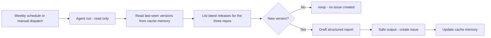

# Watch Playwright Releases with an Agentic Workflow

## Purpose

This scenario sets up a [GitHub Agentic Workflow](https://github.github.com/gh-aw/)
(gh-aw) that watches for new releases of the three Playwright tools this repository builds
on — Playwright, Playwright CLI, and Playwright MCP — and opens a single, well-structured
GitHub issue whenever a new version ships. The workflow runs weekly and on demand, reads
release data with read-only tools, and creates the issue through gh-aw safe outputs so the
agent never needs write access.

Use it as a template for turning any recurring "watch an upstream project" task into an
auditable, low-noise agentic workflow.

## Learning goals

By the end of the scenario, you will be able to:

- explain how a gh-aw workflow is defined in Markdown and compiled to a GitHub Actions
  `.lock.yml` file;
- describe how safe outputs, read-only permissions, and the network firewall keep the run
  contained;
- compile, preview, and run the workflow; and
- read the generated release issue and decide whether to act on it.

## What this scenario is and is not

This scenario is an information-gathering workflow. It reports upstream releases and drafts
an upgrade checklist; it never changes `package.json`, the lockfile, or any code. Dependency
upgrades stay a deliberate, human-reviewed step, as required by [AGENTS.md](../../../AGENTS.md).

The issue body is generated by an AI agent from live release data. Treat it as a first
draft and verify the highlights against the linked changelogs before acting.

## How the workflow works



| Artifact | Role |
| --- | --- |
| `.github/workflows/playwright-release-watch.md` | The gh-aw workflow: frontmatter (triggers, tools, safe outputs) plus natural-language agent instructions. |
| `.github/workflows/playwright-release-watch.lock.yml` | The compiled GitHub Actions workflow. Generated by `gh aw compile`; commit it alongside the `.md`. |
| `/tmp/gh-aw/cache-memory/last-seen.json` | Per-run state (last reported version per tool) held in [cache memory](https://github.github.com/gh-aw/reference/cache-memory/). |

## Prerequisites

- The [GitHub CLI](https://cli.github.com/) and the gh-aw extension:

  ```sh
  gh extension install github/gh-aw
  ```

- Write access to a fork or clone of this repository and the ability to run workflows in its
  Actions tab.
- GitHub Copilot enabled for GitHub Actions in the repository or organization. The workflow
  uses the default `copilot` engine, so no extra API key is required. To use a different
  engine, set `engine:` to `claude`, `codex`, or `gemini` and add the matching API-key secret.
- Two issue labels, `release-watch` and `dependencies`, created in the repository so the
  safe-output job can apply them.

## Step 1: Review the workflow definition

Open `.github/workflows/playwright-release-watch.md` and read the two parts:

- The YAML frontmatter declares a weekly [fuzzy schedule](https://github.github.com/gh-aw/reference/schedule-syntax/)
  plus `workflow_dispatch`, read-only `permissions`, the allowed `network` domains, the
  read-only `github` and `web-fetch` tools, `cache-memory`, and a `create-issue` safe output.
- The Markdown body is the agent's instructions: which repositories to check, how to compare
  against saved state, when to stay silent, and the exact issue structure to produce.

## Step 2: Compile the workflow

gh-aw compiles the Markdown into a pinned, hardened GitHub Actions workflow:

```sh
gh aw compile playwright-release-watch
```

Commit both `.github/workflows/playwright-release-watch.md` and the generated
`.github/workflows/playwright-release-watch.lock.yml`. Re-run the command whenever you edit
the frontmatter.

## Step 3: Preview without creating an issue (optional)

To see what the workflow would post without creating anything, enable
[staged mode](https://github.github.com/gh-aw/reference/staged-mode/) by temporarily adding
`staged: true` under `safe-outputs:` in the `.md`, recompiling, and running it. The proposed
issue appears in the Actions run summary instead of being created. Remove `staged: true` and
recompile to go live.

## Step 4: Run it manually

1. Push the branch and open the repository's Actions tab.
2. Select the `Playwright Release Watch` workflow.
3. Run it with `workflow_dispatch`.

On the first run there is no saved state, so the agent reports the current latest version of
all three tools as a baseline issue and records them. Later runs stay silent (`noop`) until a
new version appears.

## Step 5: Read the generated issue

Open the issue titled `[release-watch] New Playwright releases: ...`. It contains:

- a summary table of changed tools with previous and latest versions and release dates;
- one section per tool with the release date, a source link, this repository's pinned version
  (when relevant), highlights, and breaking-change notes; and
- a review checklist that points back to the upgrade rules in [AGENTS.md](../../../AGENTS.md).

## How it stays safe

- The agent runs read-only. The issue is created by a separate, permission-scoped job through
  the [safe outputs](https://github.github.com/gh-aw/reference/safe-outputs/) mechanism.
- The [network firewall](https://github.github.com/gh-aw/reference/network/) allows only the
  declared domains (`github`, `node`, `playwright.dev`, and infrastructure defaults).
- `deduplicate-by-title` and a saved-state check keep the workflow from posting duplicate
  reports.

## Troubleshooting

- No issue and no error: the agent found no new releases and called `noop`. Check the run
  summary to confirm.
- Blocked network request: add the domain to `network.allowed` in the `.md` and recompile.
  Inspect firewall activity with `gh aw logs` or `gh aw audit <run-id>`.
- Cache misses: [cache memory](https://github.github.com/gh-aw/reference/cache-memory/) uses
  the GitHub Actions cache with 7-day retention. If it is evicted, the next run may re-report
  the current latest versions once; `deduplicate-by-title` prevents duplicate issues.

## References

- [GitHub Agentic Workflows](https://github.github.com/gh-aw/)
- [Safe Outputs](https://github.github.com/gh-aw/reference/safe-outputs/)
- [Cache Memory](https://github.github.com/gh-aw/reference/cache-memory/)
- [Schedule Syntax](https://github.github.com/gh-aw/reference/schedule-syntax/)
- [AI-generated release notes and reports](https://github.github.com/gh-aw/guides/ai-release-notes/)
