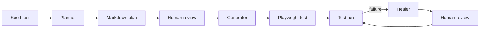

<!-- translation-meta
source: docs/scenarios/playwright-test-agents/README.md
sourceHash: sha256:5f1489e50efd30a1fc852e885c0c8cf4c8d9c357d90e90706cb85a30e1572e1f
canonicalLanguage: en
-->

# Playwright Test Agents でテストを作成・修復する

## 目的

このハンズオンシナリオでは、Visual Studio Code で利用できる 3 つの Playwright Test
Agents、planner、generator、healer を紹介します。これらを順番に使用して、
[playwright.dev](https://playwright.dev/) の小規模なテストスイートを計画し、1 つの
Playwright Test を生成して実行します。その後、意図的に制御された失敗を発生させ、
healer に修復を依頼します。

所要時間は約 45～60 分です。VS Code とターミナルを使用できるものの、Playwright Test
Agents は初めてという方を対象としています。TypeScript の基礎知識があると役立ちますが、
必須ではありません。

Playwright には 3 つの agent が標準で用意されています。planner はアプリケーションを
探索して Markdown のテスト計画を作成し、generator は計画を実行可能なテストに変換し、
healer は失敗したテストを診断・修復します。これらは個別にも、順番にも使用できます
（[Playwright Test Agents](https://playwright.dev/docs/test-agents)）。

## 学習目標

このシナリオを完了すると、次のことができるようになります。

- 各 Playwright Test Agent の責務を説明する。
- seed test、plan、generated-test の成果物を特定する。
- 各 agent に適切なファイルコンテキストとプロンプトを渡す。
- 生成された計画とテストを無条件に受け入れず、レビューする。
- 失敗を再現し、修復後のテストを再実行して healer の変更を検証する。

## このシナリオで扱うこと・扱わないこと

このシナリオは、agent を利用したテストワークフローのガイド付きサンプルです。agent は
Playwright の MCP tools を使用して、実際のページの調査、計画の保存、テストの作成、
テストの実行、失敗のデバッグを行います。これらは、このリポジトリの他のシナリオで使用する
コマンドラインのブラウザー自動操作ツールである Playwright CLI とは異なります。

このシナリオでは、AI の出力がバイト単位で完全に一致することを保証しません。実際のサイト、
利用可能なモデル、観測結果は変化する可能性があります。生成されたユーザーフロー、locator、
assertion、テスト結果を、このガイドの確認ポイントと照らし合わせてレビューしてください。

対象は、このリポジトリでは管理していない公開サイトです。Playwright のベストプラクティスでは、
自分たちが管理するシステムをテストし、サードパーティーサイトへの依存を避けることを推奨して
います。この対象は読み取り専用の学習演習には適していますが、本番用のテストスイートでは、
チームが管理するアプリケーションと安定したテストデータを使用してください
（[Playwright のベストプラクティス](https://playwright.dev/docs/best-practices)）。

## ワークフローと成果物



このリポジトリには、各作成段階の結果が 1 つずつチェックイン済みです。これらのファイルを、
入力と確認ポイントの両方として扱います。

| ファイル | ワークフローでの役割 |
| --- | --- |
| `.github/agents/playwright-test-planner.agent.md` | planner の workspace 定義と tool 権限。 |
| `.github/agents/playwright-test-generator.agent.md` | generator の workspace 定義と生成規約。 |
| `.github/agents/playwright-test-healer.agent.md` | healer の workspace 定義と修復ルール。 |
| `tests/seed.spec.ts` | planner と generator に渡す最小限の seed test。 |
| `specs/playwright-website-basic-operations.plan.md` | planner による Markdown 出力のチェックイン済みサンプル。 |
| `tests/homepage/hero-content.spec.ts` | シナリオ 1.1 から生成されたテストのチェックイン済みサンプル。 |

Playwright の規約では、agent 定義を `.github/`、計画を `specs/`、生成されたテストを
`tests/`、環境の初期化処理を seed test に保存します
（[成果物と規約](https://playwright.dev/docs/test-agents#artifacts-and-conventions)）。

## 前提条件

- 現在の Playwright リリースがサポートする macOS、Linux、または Windows。
- [Playwright のシステム要件](https://playwright.dev/docs/intro#system-requirements)に記載された、
  最新の Node.js 22.x、24.x、または 26.x リリース。
- pnpm と Git。
- VS Code 1.105 以降。Playwright の VS Code agentic experience には、このバージョン以降が
  必要です（[Playwright Test Agents](https://playwright.dev/docs/test-agents#getting-started)）。
- workspace の agent 定義で設定されたモデルを利用できる GitHub Copilot Chat。
- `https://playwright.dev/` とパッケージレジストリへのネットワークアクセス。

すべてのコマンドはリポジトリルートから実行します。clean worktree から開始するか、既存の変更を
記録し、agent の出力と区別できるようにしてください。

## ステップ 1: プロジェクトをインストールして確認する

lockfile に記録されたバージョンの依存関係をインストールします。

```sh
pnpm install --frozen-lockfile
```

Playwright Test が利用できることを確認し、Chromium が未インストールの場合はインストールします。

```sh
pnpm exec playwright --version
pnpm exec playwright install chromium
```

Playwright では、ファイルパスと `--project` を組み合わせて、設定済みの 1 つの browser project
で 1 つのファイルを実行できます。この演習を Chromium のみにすると、フィードバックループを
短くできます。リポジトリの設定では、引き続き Chromium、Firefox、WebKit をサポートしています
（[テストの実行とデバッグ](https://playwright.dev/docs/running-tests)）。

## ステップ 2: agent の生成元を理解する

Playwright は `init-agents` を使用して、editor ごとの定義を作成します。公式の VS Code 用
コマンドは次のとおりです。

```sh
npx playwright init-agents --loop=vscode
```

このリポジトリには生成済みの定義がコミットされているため、この演習中は再生成しないでください。
`.github/agents/` にある 3 つのファイルを開き、それぞれが role instructions、許可された
tool list、`playwright-test` MCP server configuration を組み合わせていることを確認します。

Playwright を意図的にアップグレードしたときは、プロジェクトローカルのバージョンで定義を
再生成し、コミットする前に差分をレビューします。

```sh
pnpm exec playwright init-agents --loop=vscode
git diff -- .github/agents
```

Playwright は、新しい tools と instructions を取り込むため、アップデート後に agent 定義を
再生成することを推奨しています
（[はじめに](https://playwright.dev/docs/test-agents#getting-started)）。

VS Code は `.github/agents` から workspace custom agents を検出します。`.agent.md`
ファイルは、その agent を選択したときに適用される instructions と tools を定義します
（[VS Code の custom agents](https://code.visualstudio.com/docs/agent-customization/custom-agents)）。

## ステップ 3: VS Code で agent を確認する

1. リポジトリルートを VS Code workspace として開きます。
2. Chat view を開きます。
3. chat input の agent picker を開きます。
4. 次の workspace agents が一覧にあることを確認します。
   - `playwright-test-planner`
   - `playwright-test-generator`
   - `playwright-test-healer`
5. `playwright-test-planner` を選択します。

以降の各リクエストでは、プロンプトを送信する前に選択中の agent を確認してください。テキストを
変更するだけでは、有効な agent instructions と tools は切り替わりません。

## ステップ 4: planner にテスト計画を依頼する

planner には、明確なリクエストと seed test が必要です。seed test は、計画と生成で再利用する
environment、fixtures、hooks、initial page context を準備します。Product Requirements
Document がある場合は、それも渡すことができます
（[Planner](https://playwright.dev/docs/test-agents#planner)）。

VS Code Chat で次のように操作します。

1. `playwright-test-planner` を選択します。
2. `tests/seed.spec.ts` を file context として追加します。
3. そのファイルが prompt context に表示されていることを確認します。
4. 次のプロンプトを送信します。

> <https://playwright.dev/> を調査し、基本的なユーザー向け操作のテスト計画を作成してください。
> ホームページ、プライマリナビゲーション、検索、カラーテーマ、ドキュメント内のナビゲーション、
> フッターを対象にしてください。
> tests/seed.spec.ts をシードテストとして使用してください。
> 各シナリオを独立させ、観測可能な結果を使用し、計画を
> specs/playwright-website-basic-operations.plan.md に保存してください。

planner は page を初期化し、実際のサイトを探索して、Markdown の計画を保存します。ブラウザーの
探索には数分かかることがあります。各 tool call が完了するまで待ち、続行前に要求された tool
approval を確認してください。

## ステップ 5: 計画をレビューする

`specs/playwright-website-basic-operations.plan.md` を開きます。チェックイン済みのファイルが、
このシナリオの確認ポイントです。新しく実行した場合は表現が異なることがありますが、利用可能な
計画は次のすべてを満たす必要があります。

1. `https://playwright.dev/` を対象としている。
2. 各シナリオに `tests/seed.spec.ts` と出力先の test file が指定されている。
3. 手順が implementation details ではなく、ユーザーに見える操作を説明している。
4. 期待結果が観測可能で、assertion に変換できるほど具体的である。
5. 各シナリオが fresh context から開始し、独立して実行できる。
6. GitHub star count のような動的コンテンツを、固定された永続的な値として扱っていない。

Markdown ファイルが存在するという理由だけで続行しないでください。生成に使用する前に、曖昧な
手順、重複するシナリオ、古い page text、安全でない state-changing actions を修正します。

## ステップ 6: 1 つのテストを生成する

出力を確認しやすくするため、シナリオ 1.1 だけを生成します。

1. VS Code Chat で `playwright-test-generator` を選択します。
2. `specs/playwright-website-basic-operations.plan.md` と `tests/seed.spec.ts` を
   file context として追加します。
3. 次のプロンプトを送信します。

> specs/playwright-website-basic-operations.plan.md のシナリオ 1.1
> "Homepage loads with hero content" だけを生成してください。
> tests/seed.spec.ts をシードとして使用してください。実際のページで各ステップを検証し、テストを
> tests/homepage/hero-content.spec.ts に書き込んでください。ほかのシナリオは生成しないでください。

generator はテストを作成する前に、計画された操作を実際のページに対して実行します。agent 定義では、
1 ファイルにつき 1 テスト、計画の group と一致する `describe` block、scenario title と一致する
test title、番号付きの計画手順を保持する comments が必要です。

## ステップ 7: 生成されたテストをレビューする

`tests/homepage/hero-content.spec.ts` を開き、計画のシナリオ 1.1 と比較します。次を確認します。

- `// spec:` と `// seed:` headers が input files を指している。
- ファイルに `test.describe('Homepage', ...)` 内の 1 テストだけが含まれている。
- 番号付きの 3 手順がすべて含まれている。
- locator が DOM-dependent CSS や XPath selectors ではなく、user-facing roles と
  accessible names を使用している。
- assertion が `toBeVisible()` のような、再試行を行う web-first matchers を使用している。
- 変化する GitHub star count が固定値ではなく pattern で照合されている。

User-facing locators と web-first assertions により、DOM や timing の変更に強いテストに
なります（[Playwright のベストプラクティス](https://playwright.dev/docs/best-practices)）。
生成されたファイルは確認ポイントとテキスト単位で一致する必要はありませんが、計画された動作と
リポジトリの規約を維持する必要があります。

## ステップ 8: 生成されたテストを実行する

Chromium で 1 つのファイルを実行します。

```sh
pnpm exec playwright test tests/homepage/hero-content.spec.ts --project=chromium
```

コマンドは終了コード 0 で終了し、1 件のテスト成功を報告する必要があります。Playwright は
デフォルトで headless 実行されます。同じテストをブラウザーで確認するには `--headed`、対話的に
調べるには `--ui` を追加します
（[テストの実行とデバッグ](https://playwright.dev/docs/running-tests)）。

テストが失敗した場合は、生成されたテストの誤り、公開サイトの変更、ネットワーク障害のどれに
該当するかを最初に判断します。成功するまで assertion を繰り返し変更せず、失敗出力を healer
のために保持してください。

## ステップ 9: 制御された失敗を作る

このステップでは、healer が実際の失敗を診断できるよう、元に戻せる locator error を 1 つ
作ります。`tests/homepage/hero-content.spec.ts` で `Get started` link の assertion を
探します。

```ts
await expect(page.getByRole('link', { name: 'Get started' })).toBeVisible();
```

accessible name だけを一時的に変更します。

```ts
await expect(page.getByRole('link', { name: 'Start the tutorial' })).toBeVisible();
```

同じコマンドをもう一度実行します。

```sh
pnpm exec playwright test tests/homepage/hero-content.spec.ts --project=chromium
```

作成した link name は実際のページと一致しないため、コマンドは 0 以外の終了コードで終了する
はずです。それでも成功する場合は、そこで停止して実際の差分を調べてください。失敗を追加しないで
ください。

## ステップ 10: healer にテストの修復を依頼する

VS Code Chat で次のように操作します。

1. `playwright-test-healer` を選択します。
2. 失敗している `tests/homepage/hero-content.spec.ts` を file context として追加します。
3. 次のプロンプトを送信します。

> tests/homepage/hero-content.spec.ts の失敗しているテストを実行して修復してください。現在の
> <https://playwright.dev/> ページに照らして失敗を診断し、堅牢性を保てる最小限の修正を加え、
> 修復したテストを再実行してください。無関係なテストを変更したり、シナリオで期待される動作を
> 弱めたりしないでください。

healer は失敗を再現して現在の UI を調査し、実際の `Get started` link に対する user-facing
locator を復元して、テストを再実行するはずです。変更を受け入れる前に編集内容をレビューします。
この制御された失敗では、広すぎる text match、任意の timeout、削除された assertion、
`test.fixme()` は修復成功とはみなしません。

## ステップ 11: 検証してクリーンアップする

最終的な変更を確認します。

```sh
git diff -- tests/homepage/hero-content.spec.ts
```

意図的に設定した `Start the tutorial` の値が残っていてはいけません。その後、同じ focused test
を自分で再実行します。

```sh
pnpm exec playwright test tests/homepage/hero-content.spec.ts --project=chromium
```

コマンドは終了コード 0 で終了する必要があります。他の generator changes がない状態で、
チェックイン済みの確認ポイントを使用した場合、test-file diff は空になるはずです。agent が生成した
plan や test の変更をレビューしてから、commit に含めるべきか判断してください。

## 成功条件

- 3 つの workspace agents がすべて表示され、各タスクに適切なものが選択されている。
- planner が seed test に基づく、レビュー可能な Markdown の計画を作成する。
- generator がシナリオ 1.1 の実行可能なテストを 1 つ作成する。
- 制御された失敗を作る前に、focused Chromium test が成功する。
- 制御された locator change により、再現可能な失敗が発生する。
- healer が対象を絞った修正を行い、独立した再実行が成功する。
- 作成した locator、skip されたテスト、raw browser artifact、無関係な変更が残っていない。

## トラブルシューティング

### custom agents が表示されない

リポジトリルートが workspace として開かれていること、VS Code が version 1.105 以降であること、
3 つのファイルが `.github/agents/` に存在することを確認します。branch を切り替えた後は VS Code
window を reload してください。それでも利用できない場合は Chat customization diagnostics を
開き、agent-loading errors を調べます。VS Code はこの診断方法を
[VS Code の custom agents](https://code.visualstudio.com/docs/agent-customization/custom-agents#frequently-asked-questions)
で説明しています。

### agent に設定されたモデルを利用できない

チェックイン済みの agent 定義ではモデルが選択されています。利用中の Copilot plan と organization
policy でそのモデルが利用できることを確認してください。この演習中に 3 つの定義をすべて暗黙的に
編集せず、model-policy mismatch は別途解決すべき環境の前提条件として扱ってください。

### MCP server または Playwright command を開始できない

lockfile に固定された依存関係を再インストールし、ローカルの Playwright binary を確認します。

```sh
pnpm install --frozen-lockfile
pnpm exec playwright --version
```

missing browser executable と報告された場合は、Chromium をインストールします。

```sh
pnpm exec playwright install chromium
```

### 計画または生成コードが確認ポイントと異なる

AI の出力と公開サイトは変化する可能性があります。formatting ではなく動作を比較してください。
計画は観測可能で独立したシナリオを記述し、テストは選択したシナリオを stable locators と assertions
で実装する必要があります。続行する前に `git diff` で変更をレビューしてください。

### 公開サイトまたはネットワークを利用できない

演習を停止し、エラーを environmental blocker として保持します。障害を製品テストの成功に
見せかけるためだけに、計画を書き換えたり assertion を削除したりしないでください。

### healer がテストを skip する

期待される `Get started` の動作が存在するため、この制御された失敗では `test.fixme()` は
許容される結果ではありません。元の assertion を復元してテストを再実行し、healer transcript で
locator error を誤分類した箇所を確認してください。

## 参考資料

最終確認日: 2026-08-09。

### 公式ドキュメント（一次情報）

- [Playwright Test Agents](https://playwright.dev/docs/test-agents) - agent のセットアップ、役割、
  入出力、成果物の規約。
- [Playwright のインストール](https://playwright.dev/docs/intro) - 対応システム、Node.js versions、
  browser installation、project structure。
- [テストの実行とデバッグ](https://playwright.dev/docs/running-tests) - focused test execution、
  browser projects、UI mode、reports。
- [Playwright のベストプラクティス](https://playwright.dev/docs/best-practices) - user-visible behavior、
  resilient locators、web-first assertions、isolation、third-party dependency guidance。
- [VS Code の custom agents](https://code.visualstudio.com/docs/agent-customization/custom-agents) -
  workspace agent discovery、file structure、tool permissions、diagnostics。
