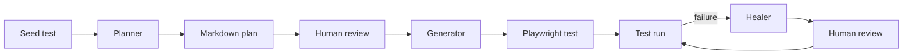

# Build and Heal Tests with Playwright Test Agents

## Purpose

This hands-on scenario introduces the three Playwright Test Agents in Visual
Studio Code: planner, generator, and healer. You will use them in sequence to
plan a small test suite for [playwright.dev](https://playwright.dev/), generate
one Playwright Test, run it, introduce a controlled failure, and ask the healer
to repair it.

The scenario takes about 45 to 60 minutes. It is written for people who can use
VS Code and a terminal but are new to Playwright Test Agents. Basic TypeScript
knowledge is useful but not required.

Playwright provides the three agents out of the box. The planner explores an
application and writes a Markdown test plan, the generator turns a plan into
executable tests, and the healer diagnoses and repairs failing tests. They can
be used independently or in sequence ([Playwright Test Agents](https://playwright.dev/docs/test-agents)).

## Learning goals

By the end of the scenario, you will be able to:

- explain the responsibility of each Playwright Test Agent;
- identify the seed test, plan, and generated-test artifacts;
- supply the right file context and prompt to each agent;
- review generated plans and tests instead of accepting them blindly; and
- verify a healer change by reproducing a failure and rerunning the repaired
  test.

## What this scenario is and is not

This scenario is a guided example of an agent-assisted testing workflow. The
agents use Playwright's MCP tools to inspect the live page, save plans, write
tests, run tests, and debug failures. They are different from Playwright CLI,
which is the command-line browser automation tool used by the other scenarios
in this repository.

The scenario does not guarantee byte-for-byte identical AI output. The live
site, available model, and observations can change. Review the resulting user
flows, locators, assertions, and test results against the checkpoints in this
guide.

The target is a public site that this repository does not control. Playwright's
best practices recommend testing systems you control and avoiding dependencies
on third-party sites. The target is suitable for this read-only learning
exercise, but use an application and stable test data controlled by your team
for production suites ([Playwright Best Practices](https://playwright.dev/docs/best-practices)).

## Workflow and artifacts



The repository already contains one checked-in result from each authoring
stage. Treat these files as both inputs and checkpoints:

| File | Role in the workflow |
| --- | --- |
| `.github/agents/playwright-test-planner.agent.md` | Workspace definition and tool permissions for the planner. |
| `.github/agents/playwright-test-generator.agent.md` | Workspace definition and generation contract for the generator. |
| `.github/agents/playwright-test-healer.agent.md` | Workspace definition and repair rules for the healer. |
| `tests/seed.spec.ts` | Minimal seed test supplied to the planner and generator. |
| `specs/playwright-website-basic-operations.plan.md` | Checked-in example of the planner's Markdown output. |
| `tests/homepage/hero-content.spec.ts` | Checked-in example of a test generated from scenario 1.1. |

Playwright conventionally stores agent definitions under `.github/`, plans
under `specs/`, generated tests under `tests/`, and environment bootstrap logic
in a seed test ([Artifacts and Conventions](https://playwright.dev/docs/test-agents#artifacts-and-conventions)).

## Prerequisites

- macOS, Linux, or Windows supported by the current Playwright release.
- A current Node.js 22.x, 24.x, or 26.x release, as listed in the
  [Playwright system requirements](https://playwright.dev/docs/intro#system-requirements).
- pnpm and Git.
- VS Code 1.105 or newer. Playwright requires this version or newer for the VS
  Code agentic experience ([Playwright Test Agents](https://playwright.dev/docs/test-agents#getting-started)).
- GitHub Copilot Chat with access to the model configured by the workspace
  agent definitions.
- Network access to `https://playwright.dev/` and the package registry.

Run every command from the repository root. Start with a clean worktree, or
record any existing changes so that you can distinguish them from agent output.

## Step 1: Install and verify the project

Install the dependency versions recorded in the lockfile:

```sh
pnpm install --frozen-lockfile
```

Confirm Playwright Test is available, then install Chromium if it is not
already present:

```sh
pnpm exec playwright --version
pnpm exec playwright install chromium
```

Playwright can run one file against one configured browser project by combining
the file path with `--project`. Keeping this exercise on Chromium makes the
feedback loop short; the repository configuration still supports Chromium,
Firefox, and WebKit ([Running and debugging tests](https://playwright.dev/docs/running-tests)).

## Step 2: Understand where the agents came from

Playwright creates editor-specific definitions with `init-agents`. The official
VS Code command is:

```sh
npx playwright init-agents --loop=vscode
```

This repository already commits the generated definitions, so do not regenerate
them during the exercise. Open the three files under `.github/agents/` and note
that each one combines role instructions, an allowed tool list, and the
`playwright-test` MCP server configuration.

When Playwright is deliberately upgraded, regenerate the definitions with the
project-local version and review their diff before committing:

```sh
pnpm exec playwright init-agents --loop=vscode
git diff -- .github/agents
```

Playwright recommends regenerating agent definitions after an update so that
new tools and instructions are included ([Getting Started](https://playwright.dev/docs/test-agents#getting-started)).

VS Code discovers workspace custom agents from `.github/agents`. An
`.agent.md` file defines the instructions and tools applied when that agent is
selected ([Custom agents in VS Code](https://code.visualstudio.com/docs/agent-customization/custom-agents)).

## Step 3: Confirm the agents in VS Code

1. Open the repository root as the VS Code workspace.
2. Open the Chat view.
3. Open the agent picker in the chat input.
4. Confirm that these workspace agents are listed:
   - `playwright-test-planner`
   - `playwright-test-generator`
   - `playwright-test-healer`
5. Select `playwright-test-planner`.

For each later request, check the selected agent before submitting the prompt.
Changing the text alone does not change which agent instructions and tools are
active.

## Step 4: Ask the planner for a test plan

The planner needs a clear request and a seed test. A seed test establishes the
environment, fixtures, hooks, and initial page context that planning and
generation should reuse. A Product Requirements Document can also be supplied
when one exists ([Planner](https://playwright.dev/docs/test-agents#planner)).

In VS Code Chat:

1. Select `playwright-test-planner`.
2. Add `tests/seed.spec.ts` as file context.
3. Confirm that the file appears in the prompt context.
4. Submit this prompt:

> Explore <https://playwright.dev/> and create a test plan for its basic user-facing
> operations. Cover the homepage, primary navigation, search, color theme,
> documentation navigation, and footer. Use tests/seed.spec.ts as the seed test.
> Keep every scenario independent, use observable outcomes, and save the plan to
> specs/playwright-website-basic-operations.plan.md.

The planner should initialize its page, explore the live site, and save a
Markdown plan. Browser exploration can take several minutes. Allow each tool
call to finish, and review any requested tool approval before continuing.

## Step 5: Review the plan

Open `specs/playwright-website-basic-operations.plan.md`. The checked-in file is
the checkpoint for this scenario. The wording may differ after a new run, but a
usable plan should satisfy all of these conditions:

1. It identifies `https://playwright.dev/` as the target.
2. Each scenario names `tests/seed.spec.ts` and a destination test file.
3. Steps describe user-visible actions rather than implementation details.
4. Expected outcomes are observable and precise enough to become assertions.
5. Scenarios can start from a fresh context and run independently.
6. Dynamic content, such as the GitHub star count, is not treated as a fixed
   permanent value.

Do not continue merely because a Markdown file exists. Correct vague steps,
duplicate scenarios, stale page text, or unsafe state-changing actions before
using the plan for generation.

## Step 6: Generate one test

Generate only scenario 1.1 so that the output remains easy to inspect:

1. Select `playwright-test-generator` in VS Code Chat.
2. Add `specs/playwright-website-basic-operations.plan.md` and
   `tests/seed.spec.ts` as file context.
3. Submit this prompt:

> Generate only scenario 1.1, "Homepage loads with hero content", from
> specs/playwright-website-basic-operations.plan.md. Use tests/seed.spec.ts as the
> seed. Verify every step against the live page and write the test to
> tests/homepage/hero-content.spec.ts. Do not generate the other scenarios.

The generator performs the planned actions against the live page before writing
the test. The agent definition requires one test per file, a `describe` block
matching the plan group, the scenario title as the test title, and comments that
retain the numbered plan steps.

## Step 7: Review the generated test

Open `tests/homepage/hero-content.spec.ts` and compare it with scenario 1.1 in
the plan. Confirm that:

- the `// spec:` and `// seed:` headers point to the input files;
- the file contains one test under `test.describe('Homepage', ...)`;
- all three numbered steps are represented;
- locators use user-facing roles and accessible names instead of DOM-dependent
  CSS or XPath selectors;
- assertions use retrying web-first matchers such as `toBeVisible()`; and
- the changing GitHub star count is matched as a pattern rather than copied as
  a fixed number.

User-facing locators and web-first assertions make tests more resilient to DOM
and timing changes ([Playwright Best Practices](https://playwright.dev/docs/best-practices)).
The generated file does not need to be textually identical to the checkpoint,
but it must preserve the planned behavior and the repository conventions.

## Step 8: Run the generated test

Run the single file on Chromium:

```sh
pnpm exec playwright test tests/homepage/hero-content.spec.ts --project=chromium
```

The command should exit with code 0 and report one passing test. Playwright runs
headless by default. To watch the same test in a browser, add `--headed`; to
inspect it interactively, add `--ui` ([Running and debugging tests](https://playwright.dev/docs/running-tests)).

If the test fails, first decide whether the generated test is wrong, the public
site changed, or the network is unavailable. Preserve the failure output for the
healer instead of repeatedly changing assertions until they pass.

## Step 9: Create a controlled failure

This step makes one reversible locator error so that the healer has a real
failure to diagnose. In `tests/homepage/hero-content.spec.ts`, find the assertion
for the `Get started` link:

```ts
await expect(page.getByRole('link', { name: 'Get started' })).toBeVisible();
```

Temporarily change only its accessible name:

```ts
await expect(page.getByRole('link', { name: 'Start the tutorial' })).toBeVisible();
```

Run the same command again:

```sh
pnpm exec playwright test tests/homepage/hero-content.spec.ts --project=chromium
```

The command should now exit with a nonzero code because the invented link name
does not match the live page. If it still passes, stop and inspect the actual
diff; do not introduce additional failures.

## Step 10: Ask the healer to repair the test

In VS Code Chat:

1. Select `playwright-test-healer`.
2. Add the failing `tests/homepage/hero-content.spec.ts` as file context.
3. Submit this prompt:

> Run and heal the failing test in tests/homepage/hero-content.spec.ts. Diagnose
> the failure against the current <https://playwright.dev/> page, make the smallest
> robust correction, and rerun the repaired test. Do not change unrelated tests or
> weaken the scenario's expected behavior.

The healer should reproduce the failure, inspect the current UI, restore a
user-facing locator for the real `Get started` link, and rerun the test. Review
the edit before accepting it. A broad text match, arbitrary timeout, removed
assertion, or `test.fixme()` does not count as a successful repair for this
controlled failure.

## Step 11: Verify and clean up

Inspect the final change:

```sh
git diff -- tests/homepage/hero-content.spec.ts
```

The deliberate `Start the tutorial` value must be gone. Then rerun the same
focused test yourself:

```sh
pnpm exec playwright test tests/homepage/hero-content.spec.ts --project=chromium
```

The command must exit with code 0. If you used the checked-in checkpoint without
other generator changes, the test-file diff should now be empty. Review any plan
or test changes produced by the agents before deciding whether they belong in a
commit.

## Success criteria

- All three workspace agents are visible and selected for the appropriate task.
- The planner produces a reviewable Markdown plan based on the seed test.
- The generator produces one executable test for scenario 1.1.
- The focused Chromium test passes before the controlled failure.
- The controlled locator change produces a reproducible failure.
- The healer makes a focused correction, and an independent rerun passes.
- No invented locator, skipped test, raw browser artifact, or unrelated edit is
  left behind.

## Troubleshooting

### The custom agents do not appear

Confirm that the repository root is the open workspace, VS Code is version
1.105 or newer, and the three files exist under `.github/agents/`. Reload the VS
Code window after switching branches. If they remain unavailable, open Chat
customization diagnostics and inspect agent-loading errors; VS Code documents
this diagnostic path in [Custom agents in VS Code](https://code.visualstudio.com/docs/agent-customization/custom-agents#frequently-asked-questions).

### The model configured by an agent is unavailable

The checked-in agent definitions select a model. Confirm that your Copilot plan
and organization policy make that model available. Do not silently edit all
three definitions during this exercise; treat a model-policy mismatch as an
environment prerequisite to resolve separately.

### The MCP server or Playwright command fails to start

Reinstall the locked dependencies and verify the local Playwright binary:

```sh
pnpm install --frozen-lockfile
pnpm exec playwright --version
```

If the error reports a missing browser executable, install Chromium:

```sh
pnpm exec playwright install chromium
```

### The plan or generated code differs from the checkpoint

AI output and the public site can change. Compare behavior rather than
formatting: the plan must describe observable independent scenarios, and the
test must implement the selected scenario with stable locators and assertions.
Use `git diff` to review changes before proceeding.

### The public site or network is unavailable

Stop the exercise and retain the error as an environmental blocker. Do not
rewrite the plan or remove assertions solely to make an outage appear as a
passing product test.

### The healer skips the test

For the controlled failure, `test.fixme()` is not an acceptable result because
the expected `Get started` behavior is present. Restore the original assertion,
rerun the test, and inspect the healer transcript for the point where it
misclassified the locator error.

## References

Last verified: 2026-08-09.

### Official documentation (primary sources)

- [Playwright Test Agents](https://playwright.dev/docs/test-agents) - agent
  setup, roles, inputs, outputs, and artifact conventions.
- [Playwright installation](https://playwright.dev/docs/intro) - supported
  systems, Node.js versions, browser installation, and project structure.
- [Running and debugging tests](https://playwright.dev/docs/running-tests) -
  focused test execution, browser projects, UI mode, and reports.
- [Playwright Best Practices](https://playwright.dev/docs/best-practices) -
  user-visible behavior, resilient locators, web-first assertions, isolation,
  and third-party dependency guidance.
- [Custom agents in VS Code](https://code.visualstudio.com/docs/agent-customization/custom-agents) -
  workspace agent discovery, file structure, tool permissions, and diagnostics.
